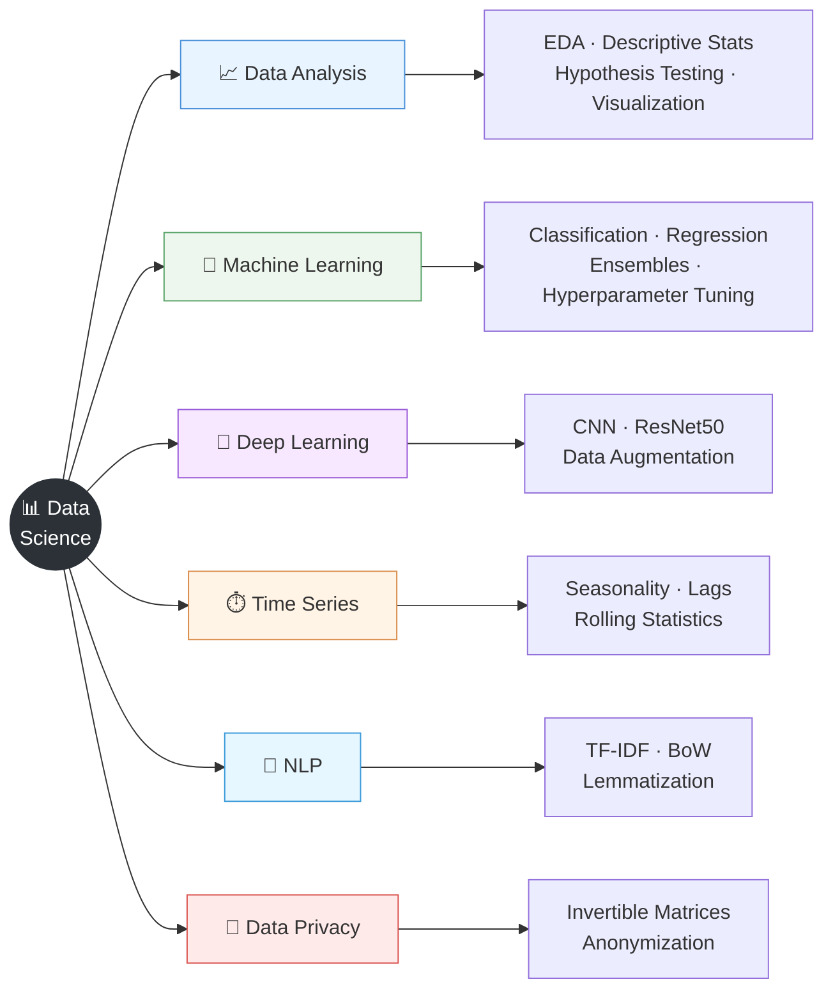

# 📊 Data Science Portfolio

> A curated collection of **14 end-to-end Data Science & Machine Learning projects**
> covering the full data pipeline — from exploratory analysis and statistical testing to
> classical ML, time-series forecasting, NLP, computer vision and privacy-preserving data transformation.


---

## 📑 Table of Contents

- [Overview](#-overview)
- [🔒 Code Access](#-code-access)
- [Repository Structure](#-repository-structure)
- [Skill Coverage](#-skill-coverage)
- [🚀 Projects](#-projects)
  - [Advanced Projects](#-advanced-projects)
  - [Machine Learning Projects](#-machine-learning-projects)
  - [Data Analysis & Statistics](#-data-analysis--statistics)
- [🛠️ Tech Stack](#️-tech-stack)
- [📬 Contact](#-contact)
- [📄 License](#-license)

---

## 📖 Overview

This repository showcases a portfolio of Data Science projects completed during my studies,
each one reflecting a different stage of the machine-learning lifecycle. The work spans the
entire analytical journey — from cleaning raw data and testing statistical hypotheses, through
building and tuning predictive models, and all the way to deep-learning and business-facing
solutions.

Every project is delivered as a **fully documented Jupyter Notebook** containing the problem
statement, data preparation, modeling experiments, evaluation against a target metric, and
business-oriented conclusions. Several projects also introduce **custom evaluation metrics**
and **monetary business logic**, reflecting real-world production constraints.

**What this portfolio demonstrates:**

- Strong command of the **Python data stack** (pandas, NumPy, Matplotlib, seaborn)
- Solid grasp of **statistics & hypothesis testing**
- Practical experience with **classical ML** (scikit-learn, LightGBM, CatBoost)
- Applied **deep learning** for computer vision (TensorFlow / Keras, ResNet50)
- **NLP** pipelines with TF-IDF / Bag-of-Words and transformer baselines
- **Time-series** forecasting with calendar features and rolling statistics
- Data **privacy / anonymization** techniques using linear algebra

---

## 🔒 Code Access

The source code for these projects is hosted in a **private repository**.

If you are a potential employer, recruiter, or collaborator interested in reviewing the
implementation details, I would be happy to **grant you access upon request**.

**📧 Contact:** [sergey.gerasimov@hotmail.com](mailto:sergey.gerasimov@hotmail.com)

---

## 🗂️ Repository Structure

The repository groups projects by domain and complexity:

```mermaid
graph TD
    ROOT["📦 Data-Science"]

    ROOT --> ADV["🚀 Advanced Projects"]
    ROOT --> ML["🤖 Machine Learning"]
    ROOT --> DA["📊 Data Analysis and Statistics"]

    ADV --> A1["Customer Churn Prediction<br/><i>Telecom · ML capstone</i>"]
    ADV --> A2["Age Prediction from Photos<br/><i>Computer Vision</i>"]
    ADV --> A3["Sentiment Analysis<br/><i>NLP</i>"]
    ADV --> A4["Taxi Order Forecasting<br/><i>Time Series</i>"]

    ML --> M1["Used Car Price Estimation"]
    ML --> M2["Data Masking Algorithm"]
    ML --> M3["Gold Recovery Prediction"]
    ML --> M4["Oil Well Location Selection"]
    ML --> M5["Bank Customer Churn"]
    ML --> M6["Telecom Tariff Recommendations"]

    DA --> D1["Video Game Success Analysis"]
    DA --> D2["Analysis of Telecom Tariffs"]
    DA --> D3["Real Estate Market Analysis"]
    DA --> D4["Borrower Reliability Research"]

    style ROOT fill:#2b3137,color:#fff,stroke:#2b3137
    style ADV fill:#f7e8ff,stroke:#9a5ad9
    style ML fill:#eef7ee,stroke:#5aa469
    style DA fill:#e8f4ff,stroke:#4a90d9
```



---

## 🧭 Skill Coverage



---

## 🚀 Projects

### 🔥 Advanced Projects

#### [Customer Churn Prediction for a Telecommunications Company](https://github.com/SergeyGer/Data-Science/tree/main/%D0%9F%D1%80%D0%BE%D0%B3%D0%BD%D0%BE%D0%B7%D0%B8%D1%80%D0%BE%D0%B2%D0%B0%D0%BD%D0%B8%D0%B5%20%D0%BE%D1%82%D1%82%D0%BE%D0%BA%D0%B0%20%D0%BA%D0%BB%D0%B8%D0%B5%D0%BD%D1%82%D0%BE%D0%B2)

Build a model to predict customer churn for a telecom company. When the model flags a
customer as likely to leave, they are offered promotional codes and special terms.
**Business value:** the cost of the promotional code is calculated against the cost of
losing a customer, turning the model into a directly monetizable decision tool.

`Python` · `pandas` · `NumPy` · `Matplotlib` · `scikit-learn` · `One-Hot Encoding` ·
**`Upsampling`** · **`LightGBM`** · **`Gradient Boosting`** · `AUC-ROC` · `Accuracy`

---

#### [Age Prediction from Photos](https://github.com/SergeyGer/Data-Science/tree/main/%D0%9A%D0%BE%D0%BC%D0%BF%D1%8C%D1%8E%D1%82%D0%B5%D1%80%D0%BD%D0%BE%D0%B5%20%D0%B7%D1%80%D0%B5%D0%BD%D0%B8%D0%B5)

Develop a deep-learning model to estimate a person's age from a photograph. The dataset
consists of facial images spanning a wide range of age groups, requiring a robust CNN
pipeline with data augmentation to generalize well.

`Python` · `TensorFlow` · `Keras` · `pandas` · `NumPy` · `Matplotlib` ·
**`Convolutional Neural Networks (CNN)`** · **`ResNet50`** · `Adam Optimizer` ·
`Learning Rate` · `ReLU` · **`Data Augmentation`** · `MAE`

---

#### [Sentiment Analysis of Customer Reviews](https://github.com/SergeyGer/Data-Science/tree/main/%D0%9E%D0%BF%D1%80%D0%B5%D0%B4%D0%B5%D0%BB%D0%B5%D0%BD%D0%B8%D0%B5%20%D1%82%D0%BE%D0%BD%D0%B0%D0%BB%D1%8C%D0%BD%D0%BE%D1%81%D1%82%D0%B8%20%D1%82%D0%B5%D0%BA%D1%81%D1%82%D0%B0)

An online store needs an automated moderation tool to detect toxic comments. The task is to
select and train a model that classifies user reviews into positive and negative categories,
with a strong focus on text vectorization and class-imbalance handling.

`Python` · `pandas` · `scikit-learn` · `NumPy` · **`Text Vectorization`** ·
**`Lemmatization`** · **`Class Imbalance (Downsampling)`** · `Logistic Regression` ·
`Decision Tree` · **`LightGBM`** · **`CatBoost`** · **`Hyperparameter Tuning`** ·
**`Bag of Words (BoW)`** · **`TF-IDF`** · `F1-score`

---

#### [Taxi Order Forecasting](https://github.com/SergeyGer/Data-Science/tree/main/%D0%9F%D1%80%D0%BE%D0%B3%D0%BD%D0%BE%D0%B7%20%D0%B7%D0%B0%D0%BA%D0%B0%D0%B7%D0%BE%D0%B2%20%D1%82%D0%B0%D0%BA%D1%81%D0%B8)

Using historical data on airport taxi orders, predict the number of orders for the next
hour so the operator can attract more drivers during peak periods. The solution explores
time-series decomposition, resampling, and calendar-based feature engineering.

`Python` · `pandas` · `Matplotlib` · `NumPy` · **`TimeSeriesSplit`** · **`Resampling`** ·
`Time Series Decomposition (Trend & Seasonality)` · **`Feature Engineering (Calendar Features)`** ·
`Logistic Regression` · `Decision Tree` · `Random Forest` · `LightGBM` · `CatBoost` ·
`Dummy Regressor` · `Hyperparameter Tuning` · **`RMSE`** · `Feature Importance`

---

### 🤖 Machine Learning Projects

#### [Used Car Price Estimation](https://github.com/SergeyGer/Data-Science/tree/main/%D0%9E%D1%86%D0%B5%D0%BD%D0%BA%D0%B0%20%D1%81%D1%82%D0%BE%D0%B8%D0%BC%D0%BE%D1%81%D1%82%D0%B8%20%D0%B0%D0%B2%D1%82%D0%BE%D0%BC%D0%BE%D0%B1%D0%B8%D0%BB%D0%B5%D0%B9)

Select and train a regression model to determine the market value of used cars from their
specifications. Emphasis on categorical encoding strategies, feature scaling and automated
hyperparameter search.

`Python` · `pandas` · `scikit-learn` · `NumPy` · `Matplotlib` ·
**`Categorical Encoding (One-Hot · Ordinal)`** · `StandardScaler` · `Box Plot` ·
`Histogram` · `Logistic Regression` · `Decision Tree` · `Random Forest` · `LightGBM` ·
`CatBoost` · **`GridSearchCV`** · `Feature Importance` · `RMSE`

---

#### [Development of a Data Masking Algorithm](https://github.com/SergeyGer/Data-Science/tree/main/%D0%97%D0%B0%D1%89%D0%B8%D1%82%D0%B0%20%D0%BA%D0%BB%D0%B8%D0%B5%D0%BD%D1%82%D1%81%D0%BA%D0%B8%D1%85%20%D0%B4%D0%B0%D0%BD%D0%BD%D1%8B%D1%85)

Develop a data-transformation method that protects the personal information of an insurance
company's clients **without degrading model quality**. The solution uses an invertible random
matrix to obfuscate features reversibly, validated with regression metrics.

`Python` · `pandas` · `NumPy` · `Linear Regression` · **`Invertible Matrix`** ·
`Matrix Multiplication` · `Random Matrix` · **`MSE`** · `R²`

---

#### [Gold Recovery Prediction from Ore](https://github.com/SergeyGer/Data-Science/tree/main/%D0%9F%D1%80%D0%BE%D0%B3%D0%BD%D0%BE%D0%B7%D0%B8%D1%80%D0%BE%D0%B2%D0%B0%D0%BD%D0%B8%D0%B5%20%D0%BF%D1%80%D0%BE%D1%86%D0%B5%D0%BD%D1%82%D0%B0%20%D0%B2%D0%BE%D1%81%D1%81%D1%82%D0%B0%D0%BD%D0%BE%D0%B2%D0%BB%D0%B5%D0%BD%D0%B8%D1%8F%20%D0%B7%D0%BE%D0%BB%D0%BE%D1%82%D0%B0%20%D0%B8%D0%B7%20%D1%80%D1%83%D0%B4%D1%8B)

Build a model to predict the recovery rate of gold from gold-bearing ore during the
purification process. The project introduces a **custom quality metric** based on sMAPE
and requires careful preprocessing (forward/backward fill, outlier removal, normality checks).

`Python` · `pandas` · `NumPy` · `Matplotlib` · `scikit-learn` · **`Data Preprocessing`** ·
`Forward Fill` · `Backward Fill` · `Linear Regression` · `Decision Tree` · `Random Forest` ·
`Dummy Regressor` · `GridSearchCV` · `MAE` · **`Custom Quality Metric`** ·
**`Normal Distribution`** · `Outlier Removal`

---

#### [Selecting Profitable Oil Well Locations](https://github.com/SergeyGer/Data-Science/tree/main/%D0%92%D1%8B%D0%B1%D0%BE%D1%80%20%D0%BB%D0%BE%D0%BA%D0%B0%D1%86%D0%B8%D0%B8%20%D0%B4%D0%BB%D1%8F%20%D0%BD%D0%B5%D1%84%D1%82%D1%8F%D0%BD%D1%8B%D1%85%20%D1%81%D0%BA%D0%B2%D0%B0%D0%B6%D0%B8%D0%BD)

Build a machine-learning model for an oil company that identifies the best drilling locations —
maximizing profit while minimizing financial risk. Uses **bootstrapping** to quantify the
profit distribution and support the final business decision.

`Python` · `pandas` · `NumPy` · `Matplotlib` · `scikit-learn` · `Data Preprocessing` ·
**`Correlation Matrix`** · `StandardScaler` · `Linear Regression` · **`Bootstrap`** ·
`MSE` · `RMSE` · `Custom Metric` · **`tqdm`**

---

#### [Bank Customer Churn Prediction](https://github.com/SergeyGer/Data-Science/tree/main/%D0%9F%D1%80%D0%BE%D0%B3%D0%BD%D0%BE%D0%B7%D0%B8%D1%80%D0%BE%D0%B2%D0%B0%D0%BD%D0%B8%D0%B5%20%D0%BE%D1%82%D1%82%D0%BE%D0%BA%D0%B0%20%D0%BA%D0%BB%D0%B8%D0%B5%D0%BD%D1%82%D0%BE%D0%B2%20%D0%B1%D0%B0%D0%BD%D0%BA%D0%B0)

Develop a classification model that predicts whether a customer will leave a commercial bank
in the near future. The project compares imbalance-handling strategies (upsampling, downsampling,
class-weight balancing) and evaluates a **custom quality metric** alongside AUC-ROC and F1.

`Python` · `pandas` · `Matplotlib` · `scikit-learn` · `Data Preprocessing` ·
`One-Hot Encoding` · **`Class Weight Balancing`** · **`Upsampling`** · **`Downsampling`** ·
`Logistic Regression` · `Random Forest` · `Decision Tree` · **`AUC-ROC`** · `F1-score` ·
`Custom Metric` · `shuffle` · `tqdm`

---

#### [Telecom Tariff Recommendations](https://github.com/SergeyGer/Data-Science/tree/main/%D0%A0%D0%B5%D0%BA%D0%BE%D0%BC%D0%B5%D0%BD%D0%B4%D0%B0%D1%86%D0%B8%D1%8F%20%D1%82%D0%B0%D1%80%D0%B8%D1%84%D0%BE%D0%B2)

Analyze subscriber behaviour for a mobile operator and build a model that recommends the
most suitable plan (tariff) for each user. A baseline **Dummy Classifier** is used to
validate that the chosen model significantly outperforms a naive guess.

`Python` · `pandas` · `scikit-learn` · `Data Preprocessing` · `Logistic Regression` ·
`Random Forest` · `Decision Tree` · **`Dummy Classifier`** · `Accuracy` · `accuracy_score`

---

### 📈 Data Analysis & Statistics

#### [Video Game Success Analysis](https://github.com/SergeyGer/Data-Science/tree/main/%D0%92%D1%8B%D1%8F%D0%B2%D0%BB%D0%B5%D0%BD%D0%B8%D0%B5%20%D0%B7%D0%B0%D0%BA%D0%BE%D0%BD%D0%BE%D0%BC%D0%B5%D1%80%D0%BD%D0%BE%D1%81%D1%82%D0%B5%D0%B9,%20%D0%BE%D0%BF%D1%80%D0%B5%D0%B4%D0%B5%D0%BB%D1%8F%D1%8E%D1%89%D0%B8%D1%85%20%D0%BA%D0%BE%D0%BC%D0%BC%D0%B5%D1%80%D1%87%D0%B5%D1%81%D0%BA%D1%83%D1%8E%20%D1%83%D1%81%D0%BF%D0%B5%D1%88%D0%BD%D0%BE%D1%81%D1%82%D1%8C%20%D0%BA%D0%BE%D0%BC%D0%BF%D1%8C%D1%8E%D1%82%D0%B5%D1%80%D0%BD%D1%8B%D1%85%20%D0%B8%D0%B3%D1%80)

Identify patterns that determine the commercial success of a video game using historical
sales data, user/critic reviews, genres and platforms — to inform future advertising campaigns.
Combines EDA with formal statistical hypothesis testing.

`Python` · `pandas` · `NumPy` · `Matplotlib` · `SciPy` · `Data Preprocessing` ·
**`Exploratory Data Analysis (EDA)`** · `Descriptive Statistics` ·
**`Statistical Hypothesis Testing`**

---

#### [Analysis of Telecom Tariffs](https://github.com/SergeyGer/Data-Science/tree/main/%D0%9F%D1%80%D0%B5%D0%B4%D0%B2%D0%B0%D1%80%D0%B8%D1%82%D0%B5%D0%BB%D1%8C%D0%BD%D1%8B%D0%B9%20%D0%B0%D0%BD%D0%B0%D0%BB%D0%B8%D0%B7%20%D1%82%D0%B0%D1%80%D0%B8%D1%84%D0%BE%D0%B2%20%D1%81%D0%BE%D1%82%D0%BE%D0%B2%D0%BE%D0%B9%20%D1%81%D0%B2%D1%8F%D0%B7%D0%B8)

Conduct a preliminary analysis of mobile tariffs and subscriber behavior to determine which
plan generates more revenue. Focuses on handling missing values, distribution analysis and
hypothesis testing with statistical significance checks.

`Python` · `pandas` · `NumPy` · `Matplotlib` · `SciPy` · `Data Preprocessing` ·
**`Handling Missing Values`** · `Histogram` · `Box Plot` · `Hypothesis Testing` ·
**`Statistical Significance (p-value)`**

---

#### [Real Estate Market Analysis (Apartment Sales)](https://github.com/SergeyGer/Data-Science/tree/main/%D0%98%D1%81%D1%81%D0%BB%D0%B5%D0%B4%D0%BE%D0%B2%D0%B0%D0%BD%D0%B8%D0%B5%20%D0%BE%D0%B1%D1%8A%D1%8F%D0%B2%D0%BB%D0%B5%D0%BD%D0%B8%D0%B9%20%D0%BE%20%D0%BF%D1%80%D0%BE%D0%B4%D0%B0%D0%B6%D0%B5%20%D0%BA%D0%B2%D0%B0%D1%80%D1%82%D0%B8%D1%80)

Determine the market value of real-estate properties and identify the typical parameters
affecting price, based on classified ads data. Emphasizes data cleaning, visualization and
correlation analysis.

`Python` · `pandas` · `Data Preprocessing` · `EDA` · **`Data Visualization`** ·
`Box Plot` · `Histograms` · **`Poisson Distribution`** · `Correlation Matrix`

---

#### [Borrower Reliability Research](https://github.com/SergeyGer/Data-Science/tree/main/%D0%98%D1%81%D1%81%D0%BB%D0%B5%D0%B4%D0%BE%D0%B2%D0%B0%D0%BD%D0%B8%D0%B5%20%D0%BD%D0%B0%D0%B4%D1%91%D0%B6%D0%BD%D0%BE%D1%81%D1%82%D0%B8%20%D0%B7%D0%B0%D1%91%D0%BC%D1%89%D0%B8%D0%BA%D0%BE%D0%B2)

Investigate whether a client's marital status and number of children influence the probability
of loan default. The results feed into a **Credit Scoring** system that assesses a potential
borrower's ability to repay a loan.

`Python` · `pandas` · `PyMystem3` · `Data Preprocessing` · `Lemmatization` ·
**`Data Categorization`** · **`Handling Duplicates`** · `Pivot Table`

---

## 🛠️ Tech Stack

| Category | Tools & Libraries |
|----------|-------------------|
| **Language** | Python 3.9+ |
| **Data handling** | pandas, NumPy |
| **Visualization** | Matplotlib, seaborn, Plotly |
| **Machine Learning** | scikit-learn, LightGBM, CatBoost |
| **Deep Learning** | TensorFlow, Keras, ResNet50 |
| **NLP** | PyMystem3, TF-IDF, Bag-of-Words, Lemmatization |
| **Statistics** | SciPy, statsmodels |
| **Model Selection** | GridSearchCV, TimeSeriesSplit, Bootstrapping |
| **Environment** | Jupyter Notebook |

---

## 📬 Contact

- **Author:** Sergey Gerasimov
- **GitHub:** [@SergeyGer](https://github.com/SergeyGer)
- **Email:** [sergey.gerasimov@hotmail.com](mailto:sergey.gerasimov@hotmail.com)

---

## 📄 License

Distributed under the **MIT License**. See `LICENSE` for details.
````

---

## Текст для поля **About** на GitHub

Короткий и «продающий» вариант (в пределах ~350 символов, с ключевыми словами для поиска):

```
Data Science & Machine Learning portfolio: 14 end-to-end projects covering EDA, statistics, classification, regression, time series, NLP, computer vision and data privacy. Python · scikit-learn · LightGBM · CatBoost · TensorFlow.
```

Более лаконичный:

```
14 end-to-end Data Science projects — EDA, ML, time series, NLP, computer vision & data privacy. Python · scikit-learn · LightGBM · TensorFlow.
```

---

## Topics (теги репозитория)

```
data-science, machine-learning, deep-learning, python, jupyter,
scikit-learn, lightgbm, catboost, tensorflow, keras, nlp, computer-vision,
time-series, eda, statistics, credit-scoring, portfolio
~~~

---
